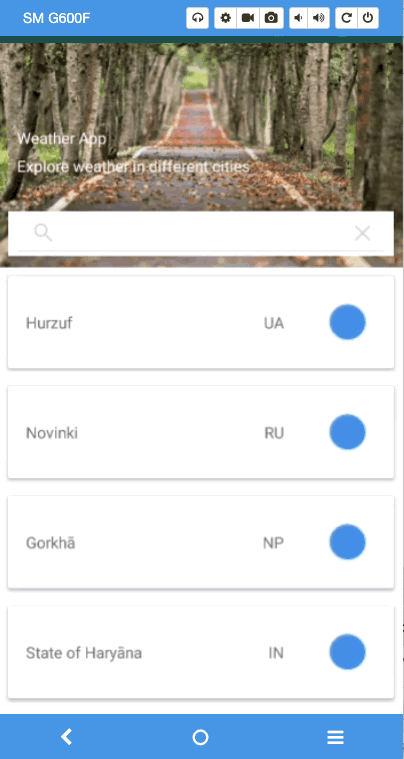

<h1>Android Weather App(Jayway)</h1>

Allows the user to view the current weather by city.  
MVVM(Model-View-ModelView) architectural pattern was used.

<h2>Externally Used Library</h2>
<a href = "https://openweathermap.org/">OpenWeather</A> returns the current weather data by city id, and private key sent. 
<a href = "https://square.github.io/retrofit/">Retrofit</a> and <a href = "https://square.github.io/okhttp/">OkHttp</a> fetch data from server as JSON data type. 
<a href = "https://github.com/google/gson">Gson</a> allows us to convert data from json to our object models  

<h2>Screen Gif</h2>

